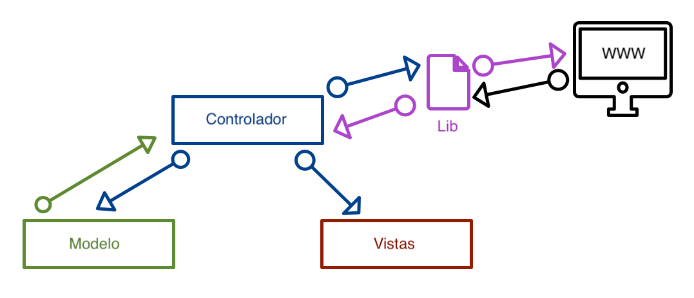

# feedNews

  1. Introducción
  2. Configuración
  3. Funcinamiento

### Introducción

Aplicación de ```Scraping```, sobre el Framework de ```Codeigner 4```, para la obtención de contenido de páginas establecidas.  
Obtiene los siguientes valores que son almacenados en la BD [ver la estructura en al archivo adjunto].
  - Título de la noticia
  - Imagen si existe
  - La fecha actual
  - URL de la noticia
  - Fuente de la noticia
  - Cuerpo de la noticia


### Configuración

1. Copiar el paquete en la raiz del servidor web.
2. ajustar los parametros de conexión en el archivo ```.env``` que se encuentra en la raiz.
3. Crear la BD en MySQL.

### Funcionamiento

La primera vez que accedes a la web te solicita que realices el ```scraping``` para poder obtener las noticias.  
Una vez obtenidas, se muetran todas las noticias del día en la página principal.


Dentro de la misma vista principal existen 2 zonas diferenciadas:
  - El menú superior
     - Volver al Home en el nombre de la aplicacion
     - Visualizar el historico de noticias.
     - Agregar una nueva noticia
  - Dentro de cada noticia existen 3 botones
    - Ir al contenido original, enlace externo.
    - Editar la noticia, vista de edición.
    - Eliminar la noticia, mensaje de advertencia de seguridad.

En la siguiente imagen se puede ver el funcionamiento de la estructura de la aplicación.


